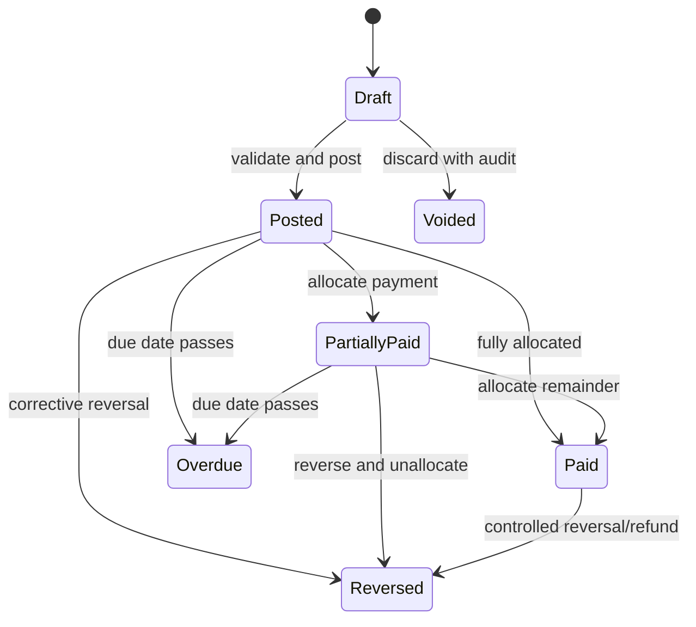
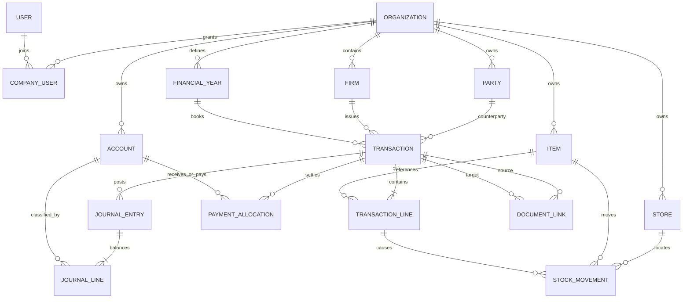

# Clean-room web application blueprint

This blueprint translates the observed APK behavior into an original, maintainable web product. It describes outcomes and domain rules rather than copying implementation, private services, branding, or proprietary code.

## Product objective

Give a small-business owner one place to create invoices, manage customers and suppliers, track stock and money, and understand the business through dependable reports. The first release should feel fast for daily billing while preserving accounting correctness and an audit trail.

## Product principles

- **One action, all books updated:** Posting an invoice updates the party ledger, stock ledger, taxes, and cash/bank allocation in one database transaction.
- **Drafts are editable; posted books are traceable:** Posted documents are corrected with controlled edits or reversals and always retain history.
- **Progressive complexity:** Basic billing is immediately usable. Tax, batches, stores, manufacturing, loyalty, and other advanced features appear only when enabled.
- **Desktop-efficient, mobile-capable:** Keyboard and table workflows matter on desktop; all essential actions remain usable on a phone.
- **Server authority:** Totals, permissions, sequences, reports, and accounting rules are enforced by the backend, not trusted from the browser.
- **Jurisdiction-ready:** Tax labels and calculations are policy/configuration modules. GST, VAT, PAN, HSN/SAC, and local document terminology must not be hardwired into generic ledger objects.

## Primary roles

| Role | Intended access |
|---|---|
| Owner / primary admin | Full company, billing, reporting, settings, users, exports, and subscription access |
| Admin | Operational access, user management as delegated, settings, reports, and all ordinary transactions |
| Accountant | Accounting entries, corrections, tax reports, exports, and reconciliation; business administration optionally restricted |
| Billing operator | Parties/items plus permitted sales, payments, returns, and printing; restricted cost/profit visibility |
| Salesperson | Assigned/customer-facing sale workflows and item availability; no business-wide dashboard or sensitive reports by default |
| Viewer / auditor | Read-only access to selected modules and exports |

Permissions should use `resource + action + scope`, for example `sale:create:any`, `sale:update:own`, `item:cost:view`, `report:pnl:view`, and `settings:tax:update`.

## Information architecture

### Primary navigation

1. **Home** — recent transactions, party balances, quick create, global search
2. **Dashboard** — sales/purchase/expense, receivable/payable, cash/bank, stock, and profit summaries
3. **Sales** — invoices, payments received, credit notes, estimates, orders, delivery notes
4. **Purchases** — bills, payments made, debit notes, purchase orders
5. **Parties** — customers/suppliers, groups, statements, reminders
6. **Items & Inventory** — items/services, stock, categories, units, adjustments, stores
7. **Cash & Bank** — accounts, transfers, adjustments, cheques, reconciliation
8. **Expenses & Income** — expense/other-income transactions and categories
9. **Reports** — accounting, party, inventory, tax, order, and operational reports
10. **More / Settings** — company, users, taxes, document design, import/export, audit, backup, integrations

On narrow screens, keep Home, Dashboard, Items, and More as bottom navigation, with create as a prominent contextual action. On desktop, use a collapsible left sidebar and a global create button.

### Suggested web routes

```text
/app/:companyId/dashboard
/app/:companyId/transactions
/app/:companyId/sales/invoices
/app/:companyId/sales/invoices/new
/app/:companyId/sales/estimates
/app/:companyId/sales/orders
/app/:companyId/sales/delivery-notes
/app/:companyId/purchases/bills
/app/:companyId/parties
/app/:companyId/parties/:partyId
/app/:companyId/items
/app/:companyId/items/:itemId
/app/:companyId/inventory/adjustments
/app/:companyId/inventory/transfers
/app/:companyId/accounts
/app/:companyId/reports/:reportKey
/app/:companyId/settings/:section
/app/:companyId/audit
```

## Core workflows

### First-run setup

1. Create account and verify identity.
2. Create company and select country, currency, time zone, fiscal-year start, and language.
3. Choose tax registration mode and enter tax identity if applicable.
4. Choose enabled features: inventory, estimates/orders, delivery notes, multiple stores, batches/serials.
5. Add opening cash/bank, first party, and first item, or import them.
6. Create a first invoice and preview the PDF.

Setup must be resumable. Optional information must never block the first invoice.

### Post a sale invoice

1. Select firm, sequence, invoice number, date/time, and customer or cash sale.
2. Add item/service lines by search, barcode, or quick-create.
3. Resolve units, store, batch/serial, quantity, free quantity, price, line discount, and line tax.
4. Apply document discounts, extra charges, withholding/collection tax, and round-off.
5. Add payment received and allocate it to cash/bank/payment mode.
6. Add due date, notes, terms, shipping/transport fields, attachments, and print options as enabled.
7. Save draft or post. The server recomputes every total and validates sequence, stock, credit limit, and permissions.
8. Generate PDF asynchronously and offer print, download, email, message, or share link.

### Receive a payment

1. Select party, date, amount, and cash/bank account.
2. Optionally allocate to one or more outstanding invoices; otherwise record as advance/unallocated credit.
3. Record reference, cheque/instrument details, attachment, and notes.
4. Post ledger/account movements atomically and refresh aging/outstanding reports.

### Return/credit note

1. Start from an original invoice when possible.
2. Select eligible lines and quantities; prevent returns above remaining eligible quantity.
3. Reverse stock, revenue/expense, discounts, tax, and party balance proportionally.
4. Refund or leave an account credit.
5. Keep a permanent conversion/reference link between documents.

### Inventory transfer

1. Select source and destination stores.
2. Add stock-controlled items, lots/batches/serials, and quantities.
3. Validate availability at the source.
4. Post paired outbound/inbound stock movements with one transfer reference.

## Transaction engine

### Transaction kinds found in the reference APK

| Reference ID | Kind | Web treatment |
|---:|---|---|
| 1 | Sale | Sale invoice |
| 2 | Purchase | Purchase bill |
| 3 | Payment-in | Receipt/payment received |
| 4 | Payment-out | Payment made |
| 7 | Expense | Expense voucher |
| 21 | Sale return | Credit note |
| 23 | Purchase return | Debit note |
| 24 | Sale order | Non-posting order until fulfilled |
| 27 | Estimate/quotation | Non-posting quote until converted |
| 28 | Purchase order | Non-posting order until fulfilled |
| 29 | Other income | Income voucher |
| 30 | Delivery challan | Stock-affecting delivery document; accounting behavior configurable |
| 50/51 | Party-to-party transfer | Paired receivable/paid sides |
| 60/61 | Fixed-asset sale/purchase | Asset-disposal/acquisition documents |
| 65 | Cancelled sale | Prefer status plus audit event, not a separate public kind |
| 67/68 | Loyalty points add/reduce | Loyalty subledger |
| 70 | Job-work-out challan | Advanced inventory module |
| 71 | Purchase job work | Advanced purchase/manufacturing module |
| 81/82 | Journal received/paid sides | Model as one balanced journal entry with lines |

The web application should use readable string identifiers and not preserve these numeric IDs as its primary domain contract.

### Lifecycle



Estimates and orders use `draft → open → partially_converted → converted/closed/cancelled`. Delivery notes use `draft → issued → partially_returned/partially_invoiced → returned/invoiced/closed`.

### Calculation order

Use a documented, jurisdiction-specific calculation pipeline. A safe generic starting order is:

1. Normalize quantity and unit conversion.
2. Compute line gross: quantity × unit price.
3. Apply line discounts.
4. Determine taxable base including/excluding configured charges.
5. Calculate line taxes with explicit rounding policy.
6. Aggregate lines.
7. Apply document discounts and charges according to policy.
8. Calculate withholding/collection taxes.
9. Apply document round-off.
10. Compute grand total, paid amount, and balance.

Persist calculation inputs, outputs, tax versions, and rounding adjustments. Never derive historic documents using today’s tax settings.

## Proposed data model



### Key tables

- Tenant: `organizations`, `firms`, `financial_years`, `users`, `company_users`, `roles`, `permissions`, `role_permissions`
- Masters: `parties`, `party_addresses`, `party_groups`, `party_group_members`, `items`, `item_categories`, `units`, `unit_conversions`, `tax_codes`, `price_lists`
- Stock: `stores`, `stock_lots`, `serial_numbers`, `stock_movements`, `stock_balances` (cached projection)
- Documents: `transactions`, `transaction_lines`, `line_taxes`, `document_charges`, `transaction_attachments`, `document_links`, `document_sequences`
- Accounting: `accounts`, `journal_entries`, `journal_lines`, `payment_allocations`, `cheques`
- Advanced: `boms`, `bom_lines`, `manufacturing_runs`, `fixed_assets`, `asset_adjustments`, `loyalty_accounts`, `loyalty_entries`
- Operations: `reminders`, `message_deliveries`, `report_schedules`, `import_jobs`, `export_jobs`, `audit_events`, `outbox_events`, `idempotency_keys`

Every tenant-owned table needs `organization_id`. Most mutable records need `created_at`, `created_by`, `updated_at`, `updated_by`, and an optimistic `version` number. Financial records need append-only audit events even where editable projections are retained.

## API boundary

Use a versioned first-party API. Representative endpoints:

```text
POST   /api/v1/auth/otp/request
POST   /api/v1/auth/otp/verify
GET    /api/v1/organizations
POST   /api/v1/organizations
GET    /api/v1/organizations/:id/parties
POST   /api/v1/organizations/:id/parties
GET    /api/v1/organizations/:id/items
POST   /api/v1/organizations/:id/items
GET    /api/v1/organizations/:id/transactions
POST   /api/v1/organizations/:id/transactions
POST   /api/v1/organizations/:id/transactions/:txnId/post
POST   /api/v1/organizations/:id/transactions/:txnId/reverse
POST   /api/v1/organizations/:id/transactions/:txnId/convert
POST   /api/v1/organizations/:id/payments
GET    /api/v1/organizations/:id/reports/:reportKey
POST   /api/v1/organizations/:id/imports
GET    /api/v1/organizations/:id/audit-events
```

Rules:

- Require an idempotency key on financial creates and external callbacks.
- Return field-level validation errors and a stable machine-readable error code.
- Use cursor pagination for transaction/party/item histories.
- Filter and authorize by organization on the server for every request.
- Generate PDFs, exports, messages, and large reports as jobs.
- Sign share links with scoped, expiring tokens; never expose sequential IDs alone.

## Reporting model

Reports must originate from ledger/stock facts, not UI-maintained totals.

- Operational reports can query transactions and materialized projections.
- Accounting reports should query journal lines by account class and period.
- Inventory reports should query stock movements/lots with opening and closing cutoffs.
- Aging uses open payment allocations and due dates, with reproducible “as of” dates.
- Every report response includes currency, time zone, filters, generated timestamp, and accounting basis.
- Exported report totals must exactly match the on-screen report for the same filter snapshot.

## Non-functional requirements

- Monetary arithmetic: database numeric/decimal; application decimal library; explicit currency scale
- Time: UTC timestamps plus organization time zone; local business date stored separately where necessary
- Performance: common lists under 500 ms at p95 after warm-up; transaction posting under 1 s excluding PDF jobs
- Availability: transaction posting must not depend on analytics, messaging, or PDF services
- Accessibility: WCAG 2.2 AA targets, complete keyboard navigation, semantic tables/forms, visible focus
- Localization: ICU-style messages, locale-aware numbers/dates, translatable PDF templates, RTL readiness
- Security: MFA option, secure sessions, CSRF protection, rate limits, encryption in transit/at rest, secret rotation
- Audit: immutable event for login/security changes, permission changes, imports, exports, post/edit/reverse, and sequence override
- Backups: encrypted automated backups, restore testing, point-in-time recovery, customer export
- Observability: structured logs with correlation IDs, metrics, tracing, and PII redaction

## MVP acceptance checkpoints

- An owner can configure a company and issue the first invoice without enabling advanced modules.
- A posted sale produces balanced journal lines and correct party, revenue, tax, stock, and payment effects.
- A purchase, payment-in/out, expense, credit note, and debit note produce independently verified postings.
- Editing/reversing a posted document leaves a complete before/after audit history.
- Concurrent invoice creation cannot issue a duplicate sequence number.
- Party statement, receivable/payable, stock summary, day book, cash flow, and P&L reconcile to source entries.
- Import is previewable, validates every row, supports partial rejection explicitly, and is idempotent on retry.
- Role restrictions are tested at the API layer, including direct-request attempts.
- PDF totals and labels match the posted document snapshot.
- Company data cannot be accessed across tenant boundaries in automated security tests.

## Delivery sequence

### Foundation

- Product decisions: target country/jurisdiction, currency, accounting basis, tax registration modes, document terminology
- Repository, CI/CD, environments, authentication, tenancy, RBAC, audit, design tokens
- Ledger and inventory posting specifications with executable tests

### Operational MVP

- Company setup, parties, items, units/categories/taxes
- Sale, purchase, receipts, payments, expenses, returns
- Cash/bank, basic PDFs, import/export, core reports

### Business controls

- Estimates/orders/delivery notes and conversions
- Multiple stores, batches/serials, credit limits, reminders
- Custom document sequences/templates, richer reports, scheduled exports

### Advanced modules

- Manufacturing, fixed assets, loyalty, service reminders
- Catalogue/e-commerce, payment links, third-party integrations

## Decisions required before implementation

1. Primary launch jurisdiction and required tax filings
2. Single currency versus multi-currency
3. Cash-basis, accrual, or both
4. Whether negative stock is allowed and by which roles
5. Whether posted documents are directly editable or reversal-only
6. Online-only launch versus offline-capable PWA
7. Required invoice languages and calendar systems
8. Subscription tiers and which capabilities are gated
9. Data migration sources and expected record volumes
10. Hosting/data-residency and retention requirements

These decisions materially change the schema and posting rules and should be settled before UI implementation starts.
